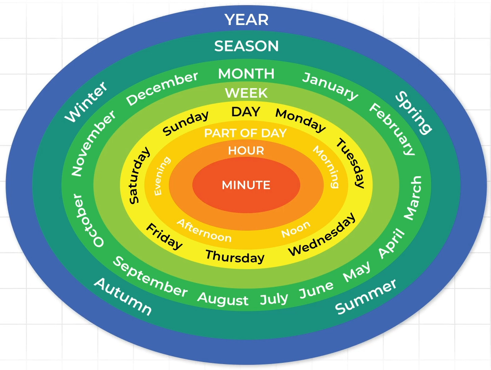

# Vocabulary

## Câu hỏi

### Who? - Từ vựng về chức danh/vịt trí/phòng ban

| Từ/Cụm từ                  | Phát âm                          | Ý nghĩa                          |
|----------------------------|----------------------------------|----------------------------------|
| Department                 | /dɪˈpɑːrtmənt/                  | Phòng ban, bộ phận               |
| Marketing                  | /ˈmɑːrkɪtɪŋ/                    | Tiếp thị                         |
| Public Relation            | /ˈpʌblɪk rɪˈleɪʃənz/            | Quan hệ công chúng               |
| Sales                      | /seɪlz/                         | Bán hàng                         |
| Customer Service           | /ˈkʌstəmər ˈsɜːrvɪs/            | Dịch vụ khách hàng               |
| Human Resources            | /ˈhjuːmən rɪˈzɔːrsɪz/          | Nhân sự                          |
| Personnel                  | /ˌpɜːrsəˈnɛl/                  | Nhân sự, nhân viên               |
| Accounting                 | /əˈkaʊntɪŋ/                    | Kế toán                          |
| CEO (Chief Executive Officer) | /ʃiː iː oʊ/ /ʧiːf ɪɡˈzɛkjʊtɪv ˈɒfɪsər/ | Giám đốc điều hành             |
| Director                   | /dəˈrɛktər/                     | Giám đốc                         |
| Secretary                  | /ˈsɛkrəˌtɛri/                   | Thư ký                           |
| Department Head            | /dɪˈpɑːrtmənt hɛd/              | Trưởng phòng                    |
| Manager                    | /ˈmænɪdʒər/                    | Quản lý                          |
| Supervisor                 | /ˈsuːpərˌvaɪzər/               | Giám sát                         |
| Assistant Manager          | /əˈsɪstənt ˈmænɪdʒər/           | Trợ lý quản lý                   |
| Regular Employee           | /ˈrɛɡjələr ɪmˈplɔɪiː/           | Nhân viên thường                 |
| Research and Development | /rɪˈsɜːrtʃ ənd dɪˈvɛləpmənt/ | Nghiên cứu và phát triển (R&D)   |

### Where? - Từ vựng về địa điểm

| Từ/Cụm từ           | Phát âm                         | Ý nghĩa                       |
|---------------------|---------------------------------|-------------------------------|
| Branch Office       | /bræntʃ ˈɔːfɪs/                | Chi nhánh văn phòng           |
| Headquarters        | /ˈhɛdˌkwɔːrtərz/               | Trụ sở chính                  |
| Library             | /ˈlaɪˌbrɛri/                   | Thư viện                      |
| Movie Theater       | /ˈmuːvi ˈθiːətər/              | Rạp chiếu phim                |
| Post Office         | /poʊst ˈɔːfɪs/                 | Bưu điện                      |
| Warehouse           | /ˈwɛrˌhaʊs/                    | Kho hàng                      |
| Lounge              | /laʊndʒ/                       | Phòng chờ, phòng thư giãn     |
| Dining Room         | /ˈdaɪnɪŋ ruːm/                 | Phòng ăn                      |
| Meeting Room        | /ˈmiːtɪŋ ruːm/                 | Phòng họp                     |
| Conference Room     | /ˈkɒnfərəns ruːm/              | Phòng hội nghị                |

### When? - Từ vựng về thời gian

| Vòng          | Từ vựng        | Phát âm         | Ý nghĩa                 |
|---------------|----------------|-----------------|-------------------------|
| YEAR          | Year           | /jɪr/           | Năm                     |
| SEASON        | Winter         | /ˈwɪntər/       | Mùa đông                |
| /ˈsiːzən/     | Spring         | /sprɪŋ/         | Mùa xuân                |
|               | Summer         | /ˈsʌmər/        | Mùa hè                  |
|               | Autumn         | /ˈɔːtəm/        | Mùa thu                 |
| MONTH         | December       | /dɪˈsɛmbər/     | Tháng Mười Hai          |
|  /mʌnθ/       | January        | /ˈdʒænjuˌɛri/   | Tháng Một               |
|               | February       | /ˈfɛbruˌɛri/    | Tháng Hai               |
|               | March          | /mɑːrtʃ/        | Tháng Ba                |
|               | April          | /ˈeɪprəl/       | Tháng Tư                |
|               | May            | /meɪ/           | Tháng Năm               |
|               | June           | /dʒuːn/         | Tháng Sáu               |
|               | July           | /dʒuˈlaɪ/       | Tháng Bảy               |
|               | August         | /ˈɔːɡəst/       | Tháng Tám               |
|               | September      | /sɛpˈtɛmbər/    | Tháng Chín              |
|               | October        | /ɒkˈtoʊbər/     | Tháng Mười              |
|               | November       | /noʊˈvɛmbər/    | Tháng Mười Một          |
| WEEK          | Saturday       | /ˈsætərˌdeɪ/    | Thứ Bảy                 |
|  /wiːk/       | Sunday         | /ˈsʌndeɪ/       | Chủ Nhật                |
|               | Monday         | /ˈmʌndeɪ/       | Thứ Hai                 |
|               | Tuesday        | /ˈtjuːzdeɪ/     | Thứ Ba                  |
|               | Wednesday      | /ˈwɛnzdeɪ/      | Thứ Tư                  |
|               | Thursday       | /ˈθɜːrzdeɪ/     | Thứ Năm                 |
|               | Friday         | /ˈfraɪdeɪ/      | Thứ Sáu                 |
| PART OF DAY   | Morning        | /ˈmɔːrnɪŋ/      | Buổi sáng               |
|/pɑːrt əv deɪ/ | Noon           | /nuːn/          | Buổi trưa               |
|               | Afternoon      | /ˌæftərˈnun/    | Buổi chiều              |
|               | Evening        | /ˈiːvnɪŋ/       | Buổi tối                |
| HOUR          | Hour           | /ˈaʊər/         | Giờ                     |
| MINUTE        | Minute         | /ˈmɪnɪt/        | Phút                    |

### Why? - Cụm từ chỉ lý do

| Từ/Cụm từ           | Phát âm               | Ý nghĩa                     |
|---------------------|-----------------------|-----------------------------|
| Bad Weather         | /bæd ˈwɛðər/          | Thời tiết xấu               |
| Technical Problem   | /ˈtɛknɪkəl ˈprɑːbləm/ | Vấn đề kỹ thuật             |
| Late Arrival        | /leɪt əˈraɪvəl/       | Masy bay đến muộn                   |
| Holiday             | /ˈhɑːləˌdeɪ/          | Kỳ nghỉ                     |
| Under Renovation    | /ˈʌndər ˌrɛnəˈveɪʃən/ | Đang cải tạo, sửa chữa      |
| Change              | /tʃeɪndʒ/             | Thay đổi                    |
| Cancel              | /ˈkænsəl/             | Hủy bỏ                      |
| Reschedule          | /riːˈskɛʤʊl/          | Thay đổi lịch   |
| Postpone            | /poʊstˈpoʊn/          | Hoãn lại                    |
| Traffic Jam         | /ˈtræfɪk ʤæm/         | Tắc đường                   |

### What? 

#### Hỏi về công việc
- What is your job?
#### Hỏi về giá tiền
- What is the price/cost of this item?
Dollar, pound, euro
- How much is this?
- How much does this cost?
#### Hỏi về thời tiết
- What is the weather today?
Foggy, rainy

| Từ/Cụm từ  | Từ loại | Phát âm        | Ý nghĩa           |
|------------|---------|----------------|-------------------|
| Dollar     | N       | /ˈdɑːlər/      | Đô la             |
| Pound      | N       | /paʊnd/        | Bảng Anh          |
| Euro       | N       | /ˈjʊəroʊ/      | Đồng Euro         |
| Foggy      | ADJ     | /ˈfɑːɡi/       | Có sương mù       |
| Rainy      | ADJ     | /ˈreɪni/       | Có mưa            |
| Sunny      | ADJ     | /ˈsʌni/        | Nắng              |

### How?

- Hỏi về số lượng: How many?

- Hỏi về tần suất: How often?

Once, twice, số đếm+times, every, hardly

- Hỏi về thời lượng: How long? ~ when

- Hỏi về giá cả: How much?

- Hỏi về khoảng cách: How far?

Mile, Kilometer, Meter

### Yes/No

| Từ/Cụm từ           | Từ loại | Phát âm             | Ý nghĩa                     |
|---------------------|---------|---------------------|-----------------------------|
| Receive             | V       | /rɪˈsiːv/           | Nhận                        |
| Catalog             | N       | /ˈkætəlɔːɡ/         | Danh mục, Quyển quảng cáo                    |
| Send                | V       | /sɛnd/              | Gửi                         |
| Email               | N/V     | /ˈiːˌmeɪl/          | Email/Gửi email             |
| Ship                | V       | /ʃɪp/               | Vận chuyển                  |
| Order               | N/V     | /ˈɔrdər/            | Đơn đặt hàng/Đặt hàng       |
| Finish              | V       | /ˈfɪnɪʃ/           | Hoàn thành                  |
| Report              | N/V     | /rɪˈpɔːrt/          | Báo cáo/Báo cáo (động từ)   |
| Mail                | N/V     | /meɪl/              | Thư/Gửi thư                 |
| Package             | N       | /ˈpækɪdʒ/          | Gói hàng                    |
| Install             | V       | /ɪnˈstɔːl/          | Cài đặt, lắp đặt            |
| Projector           | N       | /prəˈdʒɛktər/       | Máy chiếu                   |
| Client              | N       | /ˈklaɪənt/          | Khách hàng                  |
| Arrive              | V       | /əˈraɪv/            | Đến                         |

