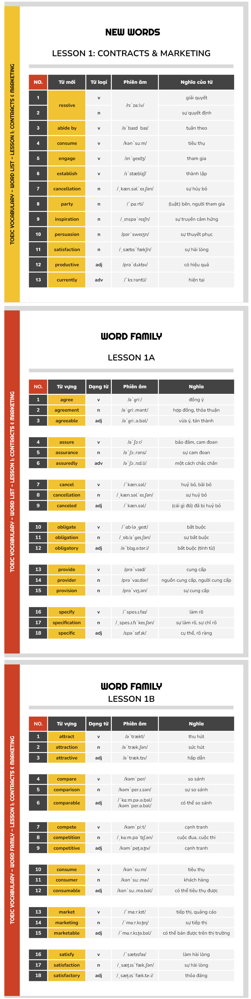

# Vocabulary

# Contract & Marketing

| Từ/Cụm từ     | Từ loại | Phát âm         | Ý nghĩa                 |
|---------------|---------|-----------------|-------------------------|
| Determine   | V                | /dɪˈtɜːrmɪn/     | Xác định, quyết định                        |
| Agreement   | N                | /əˈɡriːmənt/      | Sự thỏa thuận, hợp đồng                     |
| Provision   | N/V              | /prəˈvɪʒən/      | Sự cung cấp (N), cung cấp, quy định (V)     |
| Specify     | V                | /ˈspesɪfaɪ/      | Chỉ rõ, định rõ                             |
| Assurance   | N                | /əˈʃʊrəns/       | Sự đảm bảo, cam kết                         |
| Satisfy     | V                | /ˈsætɪsfaɪ/      | Làm hài lòng, thỏa mãn                      |
| Obligate    | V                | /ˈɒblɪɡeɪt/      | Bắt buộc                                    |
| Market      | N/V              | /ˈmɑːrkɪt/       | Thị trường (N), quảng bá, tiếp thị (V)      |
| Attract     | V                | /əˈtrækt/         | Thu hút                                     |
| Convince    | V                | /kənˈvɪns/        | Thuyết phục                                 |
| Compare     | V                | /kəmˈpeər/        | So sánh                                     |
| Compete     | V                | /kəmˈpiːt/        | Cạnh tranh                                  |
| Fad         | N                | /fæd/             | Mốt nhất thời                              |
| Resolve       | N/V             | /rɪˈzɒlv/         | Giải pháp (N), giải quyết (V)             |
| Abide by      | V               | /əˈbaɪd baɪ/      | Tuân thủ                                  |
| Consume       | V               | /kənˈsuːm/        | Tiêu thụ, sử dụng                         |
| Establish     | V               | /ɪˈstæblɪʃ/       | Thành lập, thiết lập                      |
| Cancellation  | N               | /ˌkænsəˈleɪʃn/    | Sự hủy bỏ                                 |
| Engage        | V               | /ɪnˈɡeɪdʒ/        | Tham gia, cam kết                         |
| Inspiration   | N               | /ˌɪnspəˈreɪʃn/    | Cảm hứng                                  |
| Persuasion    | N               | /pərˈsweɪʒn/      | Sự thuyết phục                            |
| Satisfaction  | N               | /ˌsætɪsˈfækʃn/    | Sự hài lòng, thỏa mãn                     |
| Party         | N/V             | /ˈpɑːrti/         | Bên (trong hợp đồng), tiệc (N); tham dự (V) |
| Productive    | ADJ             | /prəˈdʌktɪv/      | Năng suất, hiệu quả                       |
| Currently     | ADV             | /ˈkʌrəntli/       | Hiện tại, bây giờ                         |

